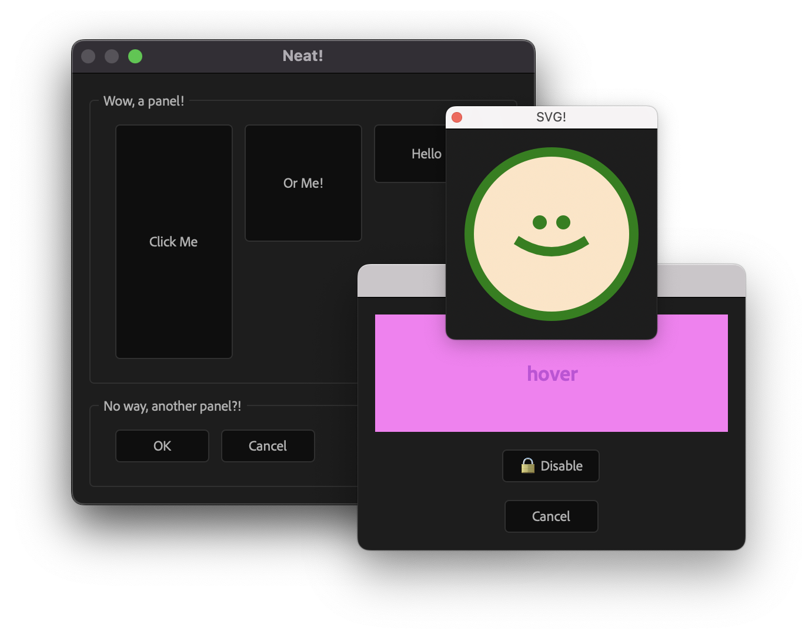

<div align="center">

# `extendscript-ui`

Declarative templating for ScriptUI/ExtendScript



</div>

Have you ever wanted to compose [ScriptUI](https://extendscript.docsforadobe.dev/user-interface-tools/scriptui-programming-model.html) with JSX, like so:

<!-- prettier-ignore -->
```tsx
<dialog text="Neat!" properties={{ closeButton: true }}>
  <button text="Click me!" size={[100, 200]} onClick={() => alert("Doink!")} />
</dialog>
```

Well, now you can! Plus, TypeScript will guide you through each prop with auto completions!

You can even create functional components:

<!-- prettier-ignore -->
```tsx
const MyHeader = ({ text }: { text: string }) => (
  <group orientation="row" alignChildren="fill">
    <static-text text={text}></static-text>
  </group>
);

const MyUI = (
  <dialog text="Could it be?!" properties={{ resizeable: true }}>
    <MyHeader text="Neat!" />
  </dialog>
);
```

And what would JSX be without "hooks":

<!-- prettier-ignore -->
```tsx
import { onWindow, uniqueId, type ScriptUIElements } from "extendscript-ui";

const MyButton = ({ text, onClick }: ScriptUIElements["button"]) => {
  const name = uniqueId("my_button");

  onWindow((window) => {
    const el = window.findElement(name);
    el.addEventListener("mouseover", () => (el.text = "Hello mouse!"));
    el.addEventListener("mouseout", () => (el.text = text));
  });

  return <button text={text} onClick={onClick} properties={{ name }}></button>;
};
```

That's not enough, you say? What if you could render SVGs? (You can!)

<!-- prettier-ignore -->
```tsx
const MySVG = ({ fill, stroke }: { fill: string, stroke: string }) => (
  <svg>
    <circle cx="75" cy="75" r="70" fill={fill} stroke={stroke} stroke-width="10" />
  </svg>
));
```

## Try it

> [!TIP]
> For a super basic example, check out [`/examples/basic`](/examples/basic)!

### Prerequisites

You'll need TypeScript and a bundler for your code. Here are some ExtendScript starters with TypeScript support to check out:

- [`@motiondeveloper/adobe-script-starter`](https://github.com/motiondeveloper/adobe-script-starter)
- [`@fartinmartin/adobe-lib-starter`](https://github.com/fartinmartin/adobe-lib-starter)
- [`@Klustre/extender`](https://github.com/Klustre/extender) (see [note on TypeScript](https://github.com/Klustre/extender?tab=readme-ov-file#typescript))

### Installation

```bash
npm i extendscript-ui
```

### Configuration

Update your `tsconfig.json`:

<!-- prettier-ignore -->
```jsonc
{
  "compilerOptions": {
    // ...your other config options

    // tell TypeScript how to find extendscript-ui's jsx.d.ts declarations:
    "typeRoots": ["./node_modules/extendscript-ui/dist"],
    "types": ["types/jsx.d.ts"],

    // tell TypeScript how to transform your JSX code and the name of the jsxFactory fn to use when doing so:
    "jsx": "react",
    "jsxFactory": "jsx" // this is the fn that extendscript-ui exports!
  }
  // ...any other options
}
```

### Usage

Be sure to use `.tsx` files for JSX syntax highlighting. Import `jsx` to satisfy TypeScript and for code completion:

<!-- prettier-ignore -->
```tsx
// index.tsx
import { jsx } from "extendscript-ui";

export const ExampleUI = (
  <dialog text="Neat!" properties={{ closeButton: true }}>
    <button text="Click me!" onClick={() => alert("Doink!")} />
  </dialog>
);
```

Then, use `createWindow` to render your template. This will create a `Window`, wire up your event callbacks, and return the `Window`.

<!-- prettier-ignore -->
```tsx
import { createWindow } from "extendscript-ui";

const window = createWindow(ExampleUI); // ExampleUI from previous code block
window.show();
```

To define behavior that requires the elements to be rendered (e.g. `element.addEventListener`) use the `onWindow` "hook". The callback function passed to `onWindow` will run after the `Window` object has been created and receives a reference to it.

<!-- prettier-ignore -->
```tsx
onWindow((window) => {
  window.addEventListener("mouseover", () => alert("Hello!"));
});
```

> [!TIP]
> ScriptUI has a helpful [`findElement` method](https://extendscript.docsforadobe.dev/user-interface-tools/window-object/#findelement) to use inside this hook! `extendscript-ui` also exports a `uniqueId` helper to ensure element `properties.name` values are valid.

<!-- prettier-ignore -->
```tsx
import { onWindow, uniqueId } from "extendscript-ui";

const MyText = ({ text, properties }) => {
  const name = properties?.name ?? uniqueId("my_text");

  onWindow((window) => {
    const el = window.findElement(name);
    el.addEventListener("mouseover", () => (el.text = "Hello mouse!"));
    el.addEventListener("mouseout", () => (el.text = text));
  });

  return <static-text text={text} properties={{ name }}></static-text>;
};
```

## How?

`extendscript-ui` uses a [custom `jsxFactory`](https://www.typescriptlang.org/tsconfig/#jsxFactory) to transform JSX into a [ScriptUI Resource Specifications](https://extendscript.docsforadobe.dev/user-interface-tools/resource-specifications.html)-compliant string. This string is passed to `new Window(specString)` to build the UI. Once the UI is built, `createWindow` adds any event handlers to the created UI elements and runs all of the side effect functions you passed to `onWindow`.

## TODO

- [ ] Set element's `size` based on `<svg width="100" height="100">`?
- [ ] Move `properties` into `InstanceProps` props?
- [ ] Default text nodes to `<static-text/>`? e.g `<button>hello!</button> === <button text="hello!"/>`
- [ ] Figure out `TreeView | ListBox | DropDownList` rendering
- [ ] Remove `type` attribute from native types since it's defined by tag?
- [ ] ProgressBar helpers?
- [ ] Turn these TODOs into issues...?
