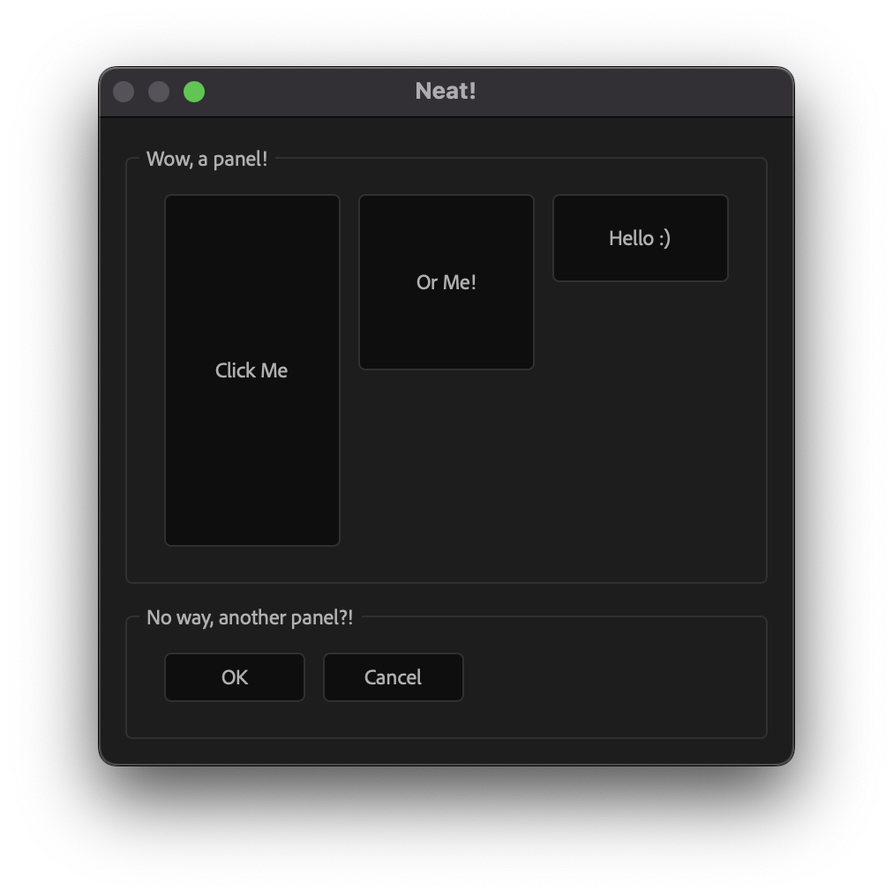

# `@extendscript-ui/example-basic`

<p align="center">
  
</p>

This example renders a basic `Dialog` with several `Button`s grouped within two `Panel`s.

## Development

The project uses [Rollup](https://rollupjs.org/) with as few dependencies and config as I could manage! It builds a single `dist/basic-v{#.#.#}.jsx` file that you can run in **After Effects** via `File > Scripts > Run Script File...`

Here's a rundown of the dependencies:

Rollup + TypeScript requires:

- `@rollup/plugin-typescript`
- `rollup`
- `tslib`
- `typescript`

> [!NOTE]
> TypeScript should be pinned to version `5.4.5`, the latest version with `target: "es3"` support, see https://github.com/microsoft/TypeScript/issues/51909. For more information on ExtendScript, check out HyperBrew's article on [Building Adobe Scripts](https://hyperbrew.co/blog/building-adobe-scripts/)!

Additionally, in order to include `extendscript-ui` code in the output `.jsx` Rollup requires `@rollup/plugin-node-resolve`, see [Rollup docs](https://rollupjs.org/troubleshooting/#warning-treating-module-as-external-dependency).

To get full type support for our host app, (e.g. things like After Effect's `alert`) we've installed `types-for-adobe`, and updated out `tsconfig.json`.

Here's a complete rundown of the `tsconfig.json`:

<!-- prettier-ignore -->
```jsonc
{
  "compilerOptions": {
    // output to es3, and ignore TypeScript's warning that es3 is old
    "target": "es3",
    "ignoreDeprecations": "5.0",

    // follow node.js conventions when locating imports
    "moduleResolution": "node",

    // make sure TypeScript yells at you for everything :)
    "strict": true,

    // don't include default DOM types etc as ExtendScript does not have those objects!
    "noLib": true,

    // since we aren't including any types by default (noLib: true), we should
    // tell TypeScript what types we DO want to include. first, defining
    // what folders to look in...
    "typeRoots": [
      "./node_modules/types-for-adobe/",
      "./node_modules/extendscript-ui/dist/jsx"
    ],
    // ...and then what sub-folders/files to look for within those typeRoots folders
    "types": ["AfterEffects/23.0", "extendscript-ui.d.ts"],

    // tell TypeScript how to transform your JSX code (react)...
    "jsx": "react",
    // and the name of the jsxFactory fn to use when doing so (`jsx`, as exported by extendscript-ui)
    "jsxFactory": "jsx"
  },

  // tell TypeScript to ignore files in our /dist folder—otherwise it may get confused
  "exclude": ["dist"]
}
```
