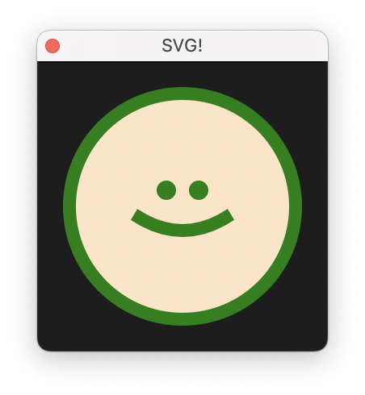

# `@extendscript-ui/svg`

<p align="center">
  
</p>

This example renders a basic `Palette` with an SVG-like graphic. `extendscript-ui`'s JSX gives us SVG syntax highlighting and type hinting. Plus, since components are functions, we can create dynamic SVGs!

<!-- prettier-ignore -->
```tsx
const Smiley = ({ fill, stroke }: { fill: string, stroke: string }) => (
  <svg>
    <circle cx="75" cy="75" r="70" fill={fill} stroke={stroke} stroke-width="10" />
    <circle cx="65" cy="65" r="6" fill={stroke} />
    <circle cx="85" cy="65" r="6" fill={stroke} />
    <path d="M45 80 Q75 100 105 80" stroke={stroke} stroke-width="10" />
  </svg>
));
```

Under the hood, `extendscript-ui` uses [ScriptUI's graphic customization objects](https://extendscript.docsforadobe.dev/user-interface-tools/graphic-customization-objects/) to render our SVGs. You can checkout [`/src/svg/draw.ts`](/src/svg/draw.ts) for more info!

<!-- prettier-ignore -->
> [!NOTE]
> `extendscript-ui` only supports a limited number of SVG elements and attributes. Documentation is coming, but for now you can check [the source](/src/jsx/elements/svg.ts)!

You can swap the Smiley SVG with the SVGTestUI to see other (less fun) SVG renders:

```diff
// src/index.tsx
- const window = createWindow(ExampleUI);
+ const window = createWindow(SVGTestUI);
```

## Development

Check out [`/examples/basic`](/examples/basic) for notes on the development setup.
